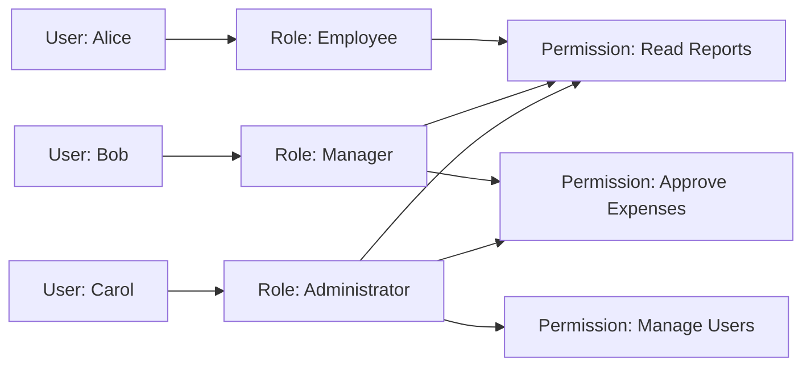
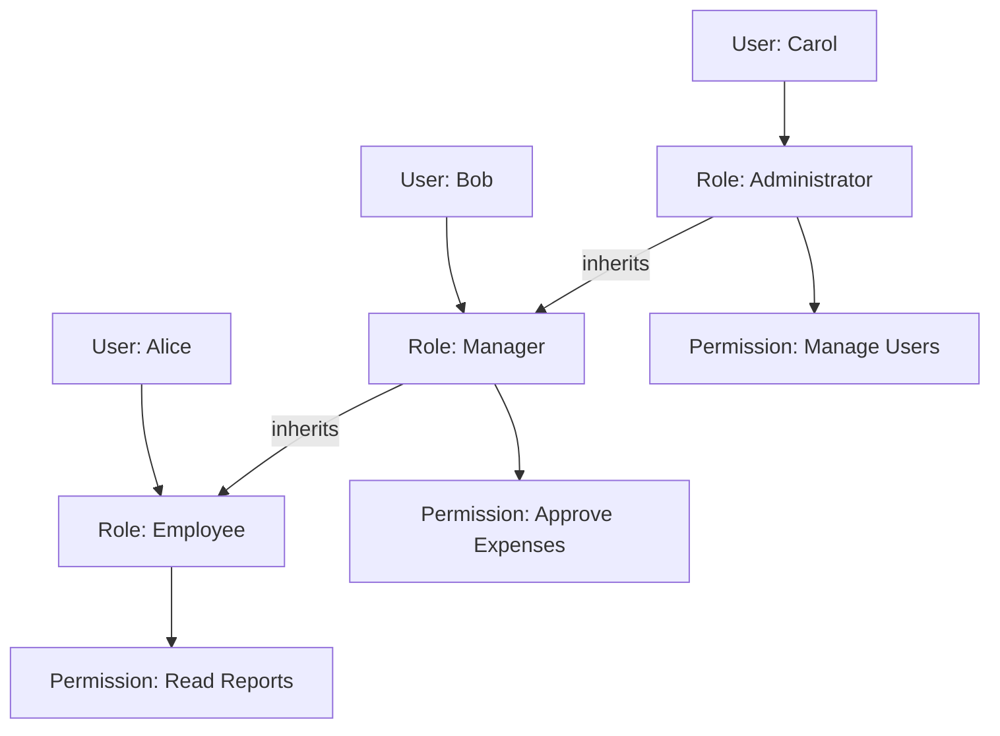

# Postgres Roles

## The RBAC Rabbit Hole

### What is RBAC
The acronym `RBAC` stands for **Role Based Access Control** and is a technology used to manage privileges. The basic definition of RBAC is that the privilege to access a business objects is determined by a primitive security concern called a `ROLE`. But **Roles** are not limited to `Access`, RBAC is also concerned with the function of that access. Once someone has authorized access (that is via some Role) what function are they allowed to preform. Since Roles are the primitive, we do not assign Roles to Users, instead Users are assigned to Roles. Permissions are assigned to Roles and the relationship between the User and the Role may or may not have a cascading effect. 

### Flat RBAC
Flat RBAC is a way of classifying the relationship between a Role(s) and User(s) in a non-hierarchical structure, in particular that means a flat structure.  **(I've read too many math books, I apologize)**. The implications of the Flat model is that Roles do not cascade , in other words there is not any inheritance. If `user1` is assigned the `Manager` Role you do not automatically inherit the `Employee` Role unless you are explicitly assigned both. 

I think we have established that Flat RBAC allows the User to acquire permissions via Roles and that the Roles that the User have been assigned to are mutually exclusive, that means they are distinct, and have no overlap. But that does not mean that relationship between Roles and Users have to be injective or even bijective. In fact Flat RBAC must support many-to-many assignments between a User and a set of Roles. Like Flat RBAC must also support the same many-to-many assignments between Roles and Permissions. To cover FLat RBAC completely we need to touch on the other two requirements of Flat RBAC: 

1. User-Role Assignment Review
2. User can use permissions from multiple Roles simultaneously. 

#### User-Role Assignment Review
This means the system must allow admins or security personnel to inspect which roles are assigned to which users. The Admin should be able to answer the following questions.

- What roles does a user have
- Which user has which role
- Which users have access to x business object.
- Should the User still have a particular Role.

The last one brings up a fair point. Because you are assigned to a give Role, the lifetime of that privilege should be finite and the expectations of which should be set when other expectations are laid out.  

### Hierarchical RBAC
This next level of RBAC adds hierarchical relationships between roles, in particular that means roles can inherit privileges from other roles. There are two schools when it comes to H-RBAC:

#### General Hierarchical RBAC
This defines the relationships between roles in the Hierarchy must be a Partial Order. 

-   :lucide-sigma:{ .lg .middle } Partial Order

    ---

    A **partial order** on a collection of objects, lets define the collection of objects as $S$. We say that $R$ is a relation on $S$ if and only if the following conditions are met:
    
    - xRx : `Reflexive Property`
    - If xRy and yRx then x and y are the same object : `Antisymmetric Property`
    - If xRy and yRz then xRz : `Transitive Property`

#### Restricted Hierarchical RBAC
This defines the relationships between roles in the Hierarchy with additional constraints on how those structures are formed: As an example, `Hierarchies are limited to simple structures such as trees or inverted trees`

###### Mermaid Diagram showing the Hierarchical nature of Hierarchical RBAC

#### Glossary
!!! PLP
    

    -   :lucide-book-a:{ .lg .middle } Principle of Least Privilege

        ---

        The `PLP` requires that a User be given no more privilege than necessary to preform the task. This is done in the following manner.
        
        - Identify the User's Job
        - Determine the Minimum set of privileges required to perform the task.
        - Restrict the User to a Domain with those privileges and nothing more.

    

!!! SoD
    

    -   :lucide-book-a:{ .lg .middle } Separation of Duties

        ---

        SoD is used to mitigate fraud when two or more users try to seize the opportunity to circumvent established policies through nefarious collaboration. Separation of duty requires that for particular sets of transactions, no single individual be allowed to execute all transactions within the set. These are attributed importance based on function, and should not be applicable globally. 

    

